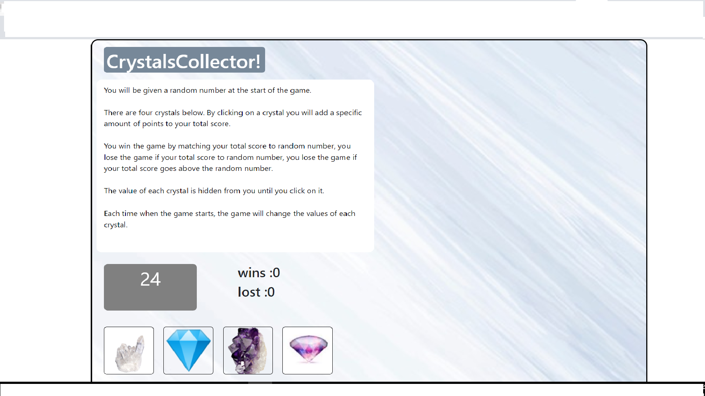

## Unit-4-game

 Click crystls to get value and match with the random number.

### Technologies used:

* HTML
* CSS (bootstrap)
* JavaScript

### Screenshot:

### Code:

Used Mathfloor(Math.random()) function to get  random number and random value for crystls

 randomNumber = Math.floor(Math.random() * 101) + 19;

 var randomValue = Math.floor(Math.random() * 11) + 1;

